# BeztaMy Financial Ecosystem - Project Status & Backlog

## Partie 1: Résumé des Réalisations (Done)

> Technical summary of the entire BeztaMy Personal Finance ecosystem developed over **one month**.

### 🏗️ Global Architecture

The system follows a **Microservices-lite** architecture with three distinct components:

1.  **Frontend (Mobile)**: Flutter app for user interaction.
2.  **Core Backend**: Spring Boot service for data, auth, and business logic.
3.  **Intelligence Layer**: Python FastAPI service for AI/RAG capabilities.

```mermaid
graph TD
    User[📱 User] -->|Interacts| Flutter[Flutter Frontend]

    subgraph "BeztaMy Ecosystem"
        Flutter -->|REST API| Spring[Spring Boot Backend]
        Flutter -->|Chat API| Python[Python Agent]

        Python -->|Tool Calls| Spring
        Spring -->|Data Persistence| DB[(PostgreSQL)]
        Python -->|Vector Search| Chroma[(ChromaDB)]
    end
```

### ✅ Implemented Capabilities

- **Secure Authentication**: End-to-end JWT flow.
- **Financial Management**: Full control over income and expenses.
- **AI Assistant**: Natural language interaction for all features.
- **Analytics**: Beautiful dashboard with charts and summaries.

---

## Partie 2: Backlog des Tâches Réalisées

> Detailed log of completed user stories across the 4-week development cycle.

### 🎨 Design & Prototyping (Figma)

| ID     | Feature   | Type   | Summary             | Description                                                    | Priority | Status | Sprint   |
| ------ | --------- | ------ | ------------------- | -------------------------------------------------------------- | -------- | ------ | -------- |
| DES-01 | **UX/UI** | Design | Dashboard Prototype | High-fidelity mockup of the main dashboard with charts         | Critical | Done   | Sprint 1 |
| DES-02 | **UX/UI** | Design | Transaction Flow    | UX flow for adding and editing transactions                    | High     | Done   | Sprint 1 |
| DES-03 | **UX/UI** | Design | Chat Interface      | Design for the AI Agent chat screen simulating messaging apps  | High     | Done   | Sprint 1 |
| DES-04 | **UX/UI** | Design | Design System       | Definition of color palette (Dark Mode), typography, and icons | Medium   | Done   | Sprint 1 |

### 📱 Frontend (Flutter)

| ID    | Feature          | Type       | Summary            | Description                                                  | Priority | Status | Sprint   |
| ----- | ---------------- | ---------- | ------------------ | ------------------------------------------------------------ | -------- | ------ | -------- |
| FE-01 | **Auth**         | User Story | User Login         | Login screen with email/password and secure token storage    | Critical | Done   | Sprint 2 |
| FE-02 | **Auth**         | User Story | User Registration  | Registration screen with form validation                     | High     | Done   | Sprint 2 |
| FE-03 | **Dashboard**    | User Story | Financial Overview | Home screen showing current balance and quick stats          | High     | Done   | Sprint 3 |
| FE-04 | **Dashboard**    | User Story | Expense Charts     | Visual FL Charts displaying spending trends                  | Medium   | Done   | Sprint 3 |
| FE-05 | **Transactions** | User Story | Transaction List   | Scrollable list of recent transactions with pull-to-refresh  | High     | Done   | Sprint 3 |
| FE-06 | **Transactions** | User Story | Add Transaction    | Form to add new income/expense with date and category picker | High     | Done   | Sprint 3 |
| FE-07 | **Chatbot**      | User Story | Chat Interface     | Messaging UI with typing indicators and message history      | High     | Done   | Sprint 4 |
| FE-08 | **Profile**      | User Story | View Profile       | Screen to view user details and logout                       | Low      | Done   | Sprint 4 |

### ☕ Core Backend (Spring Boot)

| ID    | Feature          | Type           | Summary             | Description                                               | Priority | Status | Sprint   |
| ----- | ---------------- | -------------- | ------------------- | --------------------------------------------------------- | -------- | ------ | -------- |
| BE-01 | **Security**     | Technical Task | JWT Implementation  | Spring Security filter chain for stateless authentication | Critical | Done   | Sprint 1 |
| BE-02 | **Users**        | API            | User Management     | Endpoints for Register, Login, and Get Profile            | Critical | Done   | Sprint 1 |
| BE-03 | **Transactions** | API            | Transaction CRUD    | REST APIs to Create, Read, Update, Delete transactions    | High     | Done   | Sprint 2 |
| BE-04 | **Categories**   | API            | Category Management | REST APIs to manage expense/income categories             | Medium   | Done   | Sprint 2 |
| BE-05 | **Analytics**    | API            | Dashboard Stats     | Optimized endpoint for calculating balance and totals     | High     | Done   | Sprint 3 |
| BE-06 | **Analytics**    | API            | Monthly Summary     | Endpoint aggregating data by month for charts             | Medium   | Done   | Sprint 3 |

### 🐍 Intelligence Layer (Python Agent)

| ID    | Feature         | Type         | Summary               | Description                                            | Priority | Status | Sprint   |
| ----- | --------------- | ------------ | --------------------- | ------------------------------------------------------ | -------- | ------ | -------- |
| AI-01 | **Core**        | Architecture | Agent Setup           | FastAPI server with LangGraph agent initialization     | Critical | Done   | Sprint 2 |
| AI-02 | **RAG**         | Feature      | Knowledge Retrieval   | Vector search for financial advice (Chroma DB)         | High     | Done   | Sprint 2 |
| AI-03 | **Tools**       | Feature      | Tool: Add Transaction | Natural language parsing to call `POST /transactions`  | High     | Done   | Sprint 3 |
| AI-04 | **Tools**       | Feature      | Tool: Balance Check   | Tool to fetch current balance from backend             | High     | Done   | Sprint 3 |
| AI-05 | **Tools**       | Feature      | Tool: Insights        | Tools for monthly summary and spending categorization  | Medium   | Done   | Sprint 4 |
| AI-06 | **Integration** | Security     | Auth Forwarding       | Middleware to forward User ID and Token to Spring Boot | Critical | Done   | Sprint 4 |
